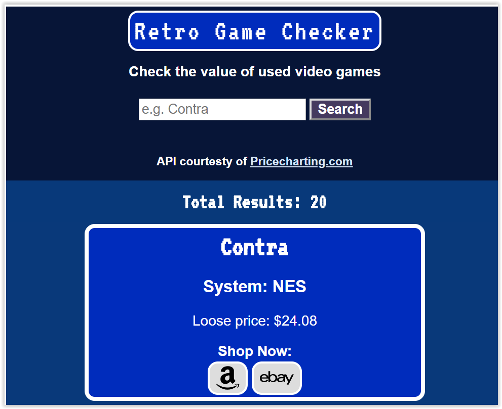

# retrogamechecker

This is a Thinkful capstone project. The goal of this project is to create an app that allows you to search for a retro video game by title and view the latest market price. In addition, the app allows the user to shop for the game on eBay and Amazon.

Try the app on GitHub Pages: https://armando2002.github.io/retrogamechecker/

Screenshot:

Resources:
<ul>
  <li>https://www.pricecharting.com/api-documentation</li>
</ul>
